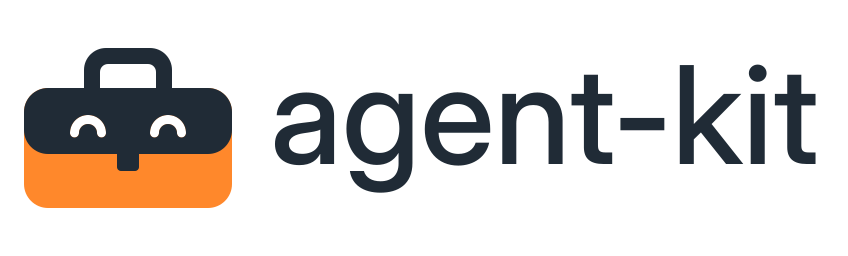
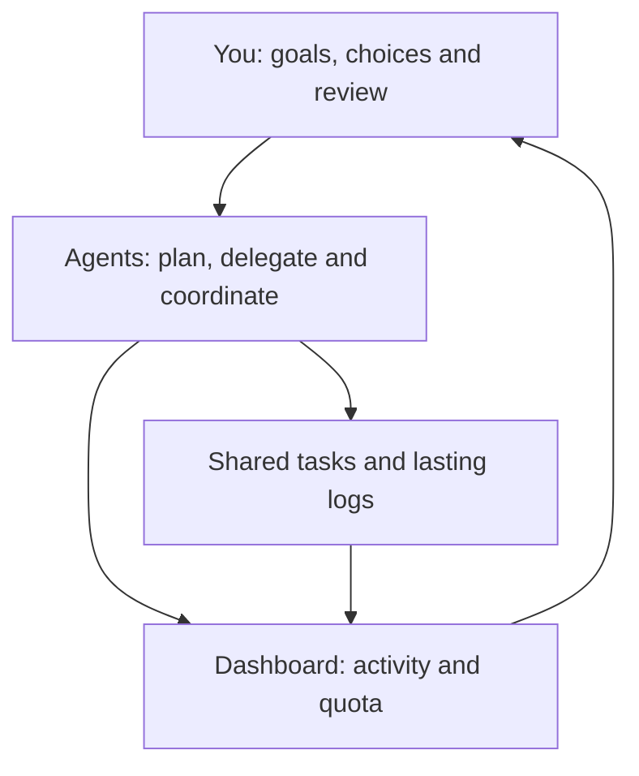
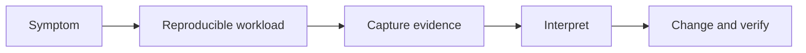
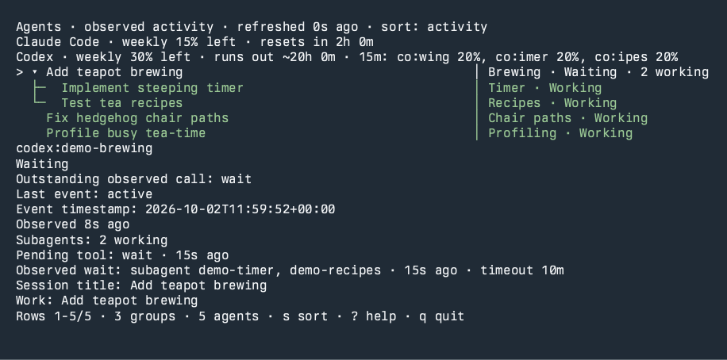
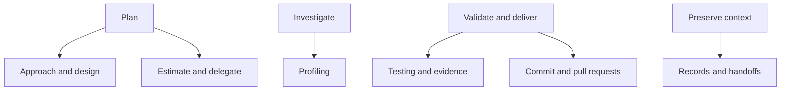
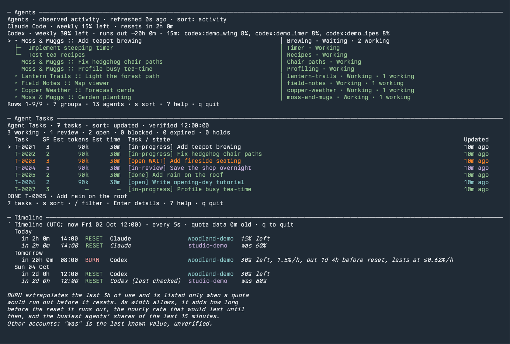
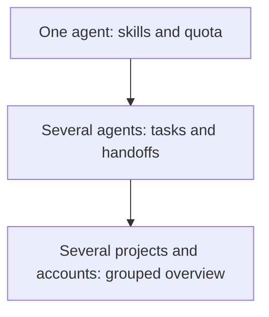
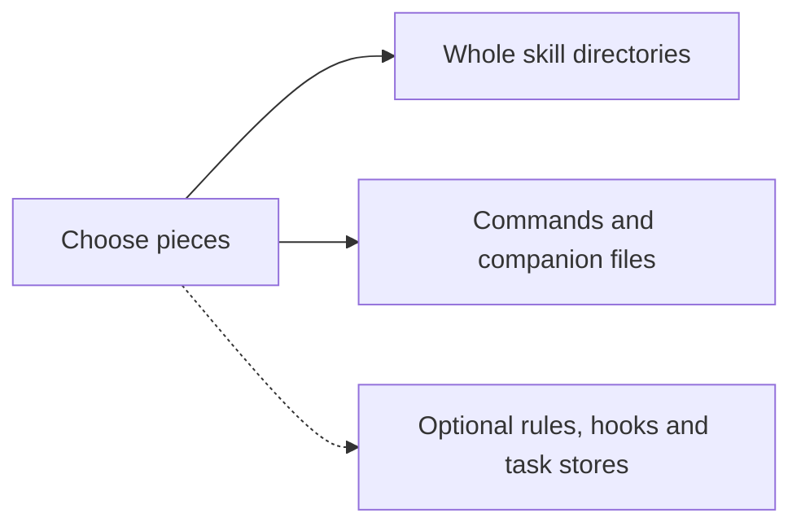
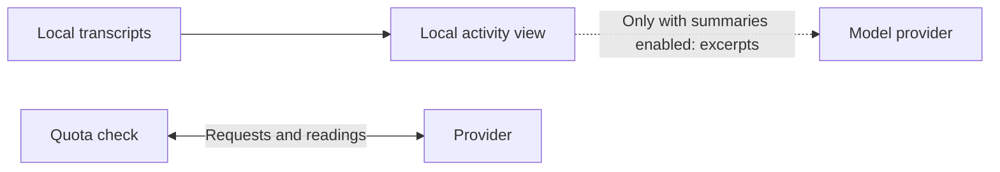

<picture id="agent-kit-wordmark">
  <source media="(prefers-color-scheme: dark)"
    srcset="docs/assets/brand/agent-kit-logo-dark.svg">
  <source media="(prefers-color-scheme: light)"
    srcset="docs/assets/brand/agent-kit-logo-light.svg">
  
</picture>

# agent-kit

**Help coding agents manage their work, and see what they're doing.**

agent-kit gives Claude Code and Codex tools and skills to:

- **Plan around quota across multiple accounts:** track remaining capacity,
  resets and usage pace so agents can manage consumption and delegation.
  You remain in control of account switching.
- **Coordinate concurrent work:** share tasks, claims, dependencies and
  messages so agents can work together across sessions.
- **Keep lasting logs:** record milestones, important events, machine
  changes and recovery information.

A live dashboard gives you an overview of agents, tasks and quota timing.
Reusable skills also cover profiling, planning, testing, review and handoffs.
Adopt individual pieces or combine them into your workflow.

[Quick start](#quick-start) · [Requirements](#requirements) ·
[Profiling](#investigate-performance-with-evidence) ·
[Agents](#follow-agents) · [Timeline](#read-the-quota-timeline) ·
[Shared tasks](#coordinate-work) · [Skills](#build-your-own-toolkit) ·
[Install](#install) · [Privacy](#privacy)

Want just the performance guidance? The [profiling skill works on its own](#profiling-only-installation), without the dashboard or task records.


*Building Moss & Muggs, a fictional woodland tea-shop game. Agent activity,
shared tasks, and quota timing shown with synthetic demo data.*

## You choose; your agents manage the work



You choose integrations, control account switching, and resolve decisions.
Agents manage their queue and report progress, evidence, and attention needs.
The dashboard gives you a place to see what is happening.


*The cottage belongs to the fictional demo world, not a separate product.*

<p align="center">
  
</p>

## Quick start

You can start with just a skill, a quota check, or the dashboard. Shared task
records and global agent rules are optional.

### Let your agent help with setup

New to the terminal? Start with your coding agent. A desktop app with local
file and command access can help with setup; otherwise it can guide you.
See [first steps](docs/start-here.md) for what to expect and how to exit.
Your existing terminal is usually enough; [terminal setup](docs/terminal.md)
is optional.

Paste this into your coding agent, such as Claude Code or Codex:

```text
Help me set up agent-kit: https://github.com/kindjie/agent-kit.
Read README.md and the setup reference in docs/install.md first.
Ask which coding agent I use and which parts I want: skills, quota and
dashboard views, shared tasks and event logs, or a combination.
Check what is installed, then install and link only the pieces I choose,
including their required companion files.
Preserve existing settings and skill entries; explain any conflicts.
Keep model summaries off. Do not add global rules or hooks, or create
shared task stores, unless I choose those integrations.
Verify the setup and show me one command or prompt to get started.
```

### Try it yourself

1. [Download the ZIP](https://github.com/kindjie/agent-kit/archive/refs/heads/main.zip),
    extract it, and open a terminal in that folder. If you already use Git
    with GitHub SSH access, you can clone it instead:

    ```sh
    git clone git@github.com:kindjie/agent-kit.git
    cd agent-kit
    ```

2. Check that the command runs. This prints help and needs no account:

    ```sh
    ./bin/agent-quota --help
    ```

3. If your Claude Code or Codex CLI is already signed in, try a quota check:

    ```sh
    ./bin/agent-quota --brief
    ```

    You'll see quota, resets, and recent usage pace. Missing observations
    stay unknown. Quota checks contact your provider and keep a local cache.

For the combined dashboard, run this when tmux is installed:

```sh
./bin/agent-dash
```

It opens Agents, Agent Tasks, and Timeline. Press `q` to quit a live view.
The task pane explains setup if you have not configured shared records.
The dashboard keeps model summaries off by default.

If a command cannot run, check the requirements below or use the setup
prompt. Want to explore without a signed-in account? Try the
[fictional demo](docs/demo/README.md).

## Requirements

You only need the requirements for the pieces you choose.

| Piece | What you need |
| --- | --- |
| Skills only | A coding agent that supports local skills |
| Commands | Python 3.9+ and a POSIX shell, on macOS or Linux |
| Live quota | A signed-in Claude Code or Codex CLI; either provider is enough |
| Combined dashboard | tmux, in addition to the command requirements |
| Shared task records | Git and task stores you explicitly configure |

The [setup reference](docs/install.md) covers installation and optional
integrations in detail. It's written for agents doing setup and people who
prefer manual configuration.

## Investigate performance with evidence

The [profiling skill](skills/profiling/SKILL.md) helps your coding agent decide
what to measure before changing code. It connects symptoms to useful signals,
guides capture with platform tools, and separates what measurements show from
what still needs testing. Use it on its own; agent quota and task records are
separate tools.

| Investigating | What the guidance covers |
| --- | --- |
| CPU work | Apple Silicon/macOS and x86 Linux; computation versus waiting, allocations, code generation, memory behavior, and scaling |
| GPU work | Frame/pass timing, submission, synchronization, and GPU memory; Metal, RADV/SteamOS, and NVIDIA tooling |
| Browser and graphics layers | WebAssembly tiering, workers, JS↔Wasm boundaries, and backend-aware guidance for sokol, raylib, OpenGL, and browser graphics |
| Parallel scaling | Work partitioning, contention, locality, NUMA, controlled workloads, and interpretation limits |

These are reference workflows, not a bundled profiler. Tools, target hardware,
and capture permissions must be checked on the host. Some steps can be run
and analyzed by an agent; others produce a capture for you to inspect or need
an interactive profiler. Unavailable hardware is a limit to report.




Example requests, illustrating how to start an investigation:

```text
Use the profiling skill to investigate uneven frame pacing in Moss & Muggs
when the tea shop is full. Establish a reproducible workload, check the
available tools, and choose evidence that distinguishes CPU work, GPU work,
and waiting. Do not optimize from source inspection alone.
```

```text
Our simulation stops getting faster as we add workers. Use the profiling
skill to distinguish work partitioning, contention, and memory/topology
limits. Explain what the available measurements can and cannot establish.
```

Start with [CPU diagnosis](skills/profiling/references/diagnosis.md) or
[GPU diagnosis](skills/profiling/references/gpu-diagnosis.md), then the
[interpretation guide](skills/profiling/references/interpretation.md).
[WebAssembly](skills/profiling/references/wasm.md) and
[NUMA](skills/profiling/references/numa.md) cover those specific investigations.
Moss & Muggs is a demonstration scenario; no performance result is claimed.

### Profiling-only installation

Use the setup prompt above and ask for **only the profiling skill**. You
need neither the dashboard nor shared task records. Installing the skill
provides guidance; it does not install profiling tools.

For manual setup, follow the [whole-directory installation instructions](
docs/install.md#profiling-only-installation). Ask your agent to **use the
profiling skill** when you want an investigation.

## Follow agents

<a id="follow-activity-and-quota"></a>

The agent tree groups parent sessions and delegated agents. Collapse groups
to see the overview, or open details to inspect the observed state and waits.
It distinguishes ended turns, reasoning, tool calls, and explicit waits while
keeping observation freshness visible.

```sh
./bin/agent-quota --agents --live --no-summaries
```



*Expand a group to distinguish the parent's wait from its helpers' activity.
Synthetic demo data; observed idle is not proof of an empty work queue.*

See the [activity close-up](docs/activity.md) for controls and what each
observed state means. For attention handoffs, `agent-speak.sh` can ring or
speak and publish a tmux badge. Agents report and clear these reasons;
silence alone does not establish a stall.
[Attention setup](docs/install.md#requirements) covers the integration.

## Read the quota timeline


See when quota resets and whether recent usage would exhaust it first:

```sh
./bin/agent-quota --timeline --live
```


*Upcoming resets and projected run-out times. Synthetic data; projections
follow recent usage, not a guaranteed schedule.*

Subscription quota and purchased credits are reported separately. Forecasts
need adequate recent observations; missing evidence stays unknown.
See the [quota reference](bin/agent-quota.md) for accounting, forecast limits,
and command options.

## Coordinate work

<a id="agent-records"></a>
<a id="live-task-view"></a>

`agent-task` is the shared agent work queue. Track ownership, leases, helpers,
dependencies, per-model estimates, and completion evidence across sessions.
`agent-changelog` records lasting machine state and recovery information.
Both use dedicated Git repositories you choose and initialize explicitly.

After [records setup](docs/records.md#agent-records):

```sh
./bin/agent-task list --live
```


*Inspect ownership, dependencies, and recorded completion evidence. Synthetic
demo records; the view is read-only.*

Enter opens details; Tab switches progress, dependencies, evidence, and
observed waits. `f` expands details, and `?` opens grouped, scrollable help.
Dependency readiness uses real task status: only `done` satisfies a
prerequisite. Recorded evidence is not a fresh CI check, and estimates are
not completion forecasts.

A [dependency diagram and ownership guide](docs/work.md) explains how
concurrent work fits together.

Keep your own decision list separate: [taskglance](
https://github.com/kindjie/taskglance) holds work needing you. The dashboard's
optional My Tasks pane does not replace the agents' shared queue.
[Records reference](docs/records.md) covers lifecycle, estimates, messages,
recovery, and the read-only boundary.

## Build your own toolkit

Skills are small sets of working instructions and references. Adopt them
individually; neither agent product nor the entire command suite is required.
They supply defaults and respect your instructions.

| When you want to… | Start with |
| --- | --- |
| Choose a sound approach | [approach-review](skills/approach-review/SKILL.md), [design-documents](skills/design-documents/SKILL.md) |
| Plan and share work | [estimate-agent-work](skills/estimate-agent-work/SKILL.md), [delegation](skills/delegation/SKILL.md), [agent-records](skills/agent-records/SKILL.md) |
| Validate and deliver a change | [testing-requirements](skills/testing-requirements/SKILL.md), [commit](skills/commit/SKILL.md), [pull-requests](skills/pull-requests/SKILL.md) |
| Judge evidence and preserve decisions | [verification-systems](skills/verification-systems/SKILL.md), [delivery-evidence](skills/delivery-evidence/SKILL.md), [repository-records](skills/repository-records/SKILL.md) |
| Preview Markdown locally | [preview-markdown](skills/preview-markdown/SKILL.md); its command needs `uv` |



For larger workflows, [coordination tools](docs/coordination.md) include
multi-task event waits, cooperative resource admission, explicit scheduler
grants, and offline usage reports. The scheduler is an opt-in pilot with
manual recovery boundaries, not an unattended scheduling service.

## As your work grows

[](docs/assets/growing-dashboard.png)

*Seven parent groups, thirteen fictional agents and four quota observations.
[Open the full-size capture](docs/assets/growing-dashboard.png) to read the details.*



Start small, then add coordination when agents work concurrently. Fold groups
for the overview and inspect tasks across configured records. Account
switching stays under your control; historical readings can be stale.
See [the growth guide](docs/growing.md) for what becomes useful at each stage.
These are workflows, not a tested maximum agent count.

## Install



Link only the commands and skill directories you want. Keep required sibling
modules together; use the [installation guide](docs/install.md) for commands,
optional rules, status lines, attention badges, and records hooks.
Always-loaded rules are a separate opt-in: read them before installing them.
No setup command in this introduction rewrites your global agent settings.
If something looks wrong, ask your agent to use
[`agent-doctor`](bin/agent-doctor.md) for read-only installation checks.
Its instruction-review prompt helps an agent look for contradictions; static
checks alone cannot establish that your instructions are consistent.

## Privacy

<a id="privacy-and-limits"></a>
<a id="what-it-reads-and-what-leaves-the-machine"></a>

Activity scanning reads local transcripts; the scan itself uploads nothing.
Quota checks contact provider services. Enabling model-generated summaries
sends bounded excerpts to a provider, which may differ from the thread's
original provider. The dashboard keeps summaries off by default.



The [privacy reference](docs/privacy.md) explains these flows and controls.

The screenshots use isolated fictional records and accounts. They contain
no private projects or measured profiling results.


## Documentation

<a id="what-is-in-it"></a>
<a id="always-loaded-rules"></a>
<a id="records-hooks"></a>
<a id="status-lines"></a>
<a id="coordination-and-efficiency"></a>

- [Command and skill catalogue](docs/tools.md)
- [Installation, rules, hooks, and status lines](docs/install.md)
- [Shared task records and live controls](docs/records.md)
- [Coordination and efficiency](docs/coordination.md)
- [Quota schema, activity, and summary contract](bin/agent-quota.md)
- [Synthetic demo and capture reproduction](docs/demo/README.md)

## Tests and contributions

<a id="tests"></a>

Focused fixes, documentation, and tests are welcome. Discuss substantial
behavior changes before building them. Follow the
[focused test instructions](tests/AGENTS.md); the full suite is:

```sh
PYTHONDONTWRITEBYTECODE=1 python3 -m unittest discover -s tests -t .
```

## Licence

[MIT](LICENSE).
