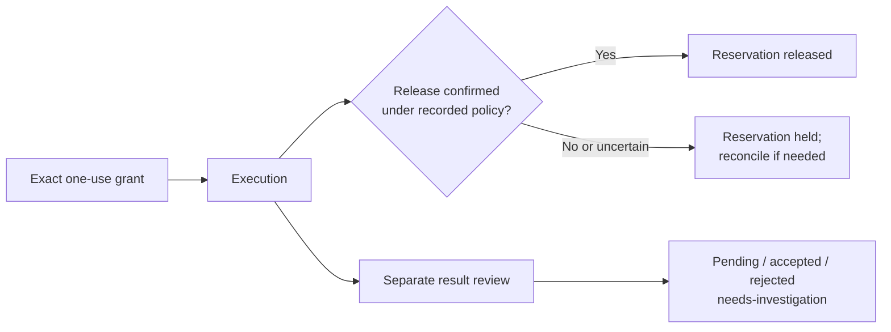

# Structured scheduler pilot

`agent-scheduler` separates an execution's resource reservation from acceptance
of its result. It is an opt-in, machine-local pilot for exclusive lanes, with
an explicit private state directory. It does not replace an existing scheduler,
discover capacity, queue jobs, install a daemon or establish machine quiet.

The coordinator grants an exact command once. A worker runs that stored command;
it cannot replace its arguments on invocation. The run is identified by the
scheduler epoch, lane, generation, run ID and worker. A completed execution can
release its reservation while semantic review is still pending or rejected.
Neither release nor acceptance grants a retry.
The binding covers the stored invocation, working directory and execution
bounds; it is not a hermetic build or a hash of executable and workspace bytes.
Result provenance remains part of the separate acceptance workflow.



Operational release and semantic acceptance are separate outcomes. Neither
branch authorizes another execution; a retry requires a new explicit grant.

## Authority and process scope

Use one agreed coordinator and state directory for a lane. Separate directories
do not coordinate with each other. Coordinator and worker IDs identify protocol
actors; they are not authentication against another process running as the same
OS user. Keep the state directory private and never store it in source control.

Automatic release requires an explicitly opted-in grant with
`--scope trusted-foreground-group`. This is a cooperative scope assertion, not
an OS containment boundary. Commands must remain in the supervised foreground
process group. Detached, daemonized or escaping descendants are outside the
automatic-release guarantee. Use manual handling for workloads whose lifecycle
cannot be confined to this contract. Observed uncertainty must retain a hold.

A clock deadline, expired task claim, quiet transcript or bare PID disappearance
is not a release certificate. Recovery never signals saved PIDs. Supervisor
death and incomplete cleanup retain the reservation for explicit reconciliation.
Boot identity must be observable. On a sandbox that denies the platform boot
query, initialization and new execution fail closed; run the authorized pilot
from an environment with that read access rather than inventing an identity.

## Manual workflow before cutover

Existing task-record grants remain authoritative until their coordinator
explicitly adopts the pilot for a drained lane. Preserve compatibility exceptions
such as selected functional overlaps; one exclusive lane cannot represent them.

Workers send one operational release request containing the exact grant/run,
terminal session status, scoped quiescence evidence, immutable receipt references
and explicit end-of-run intent. Label test results and remaining review
separately. The coordinator verifies and records operational release first, then
continues result review. A failed test does not retain a reservation after
independent cleanup verification; uncertain process scope does.

## Isolated pilot

Use a new private path. Do not initialize a live resource lane merely to try the
examples. The IDs below are synthetic; retain the actual epoch and generation
returned by your commands.

```sh
agent-scheduler --state "$pilot_state" init --coordinator coordinator-example
```

Grant one harmless execution. The coordinator chooses and records the release
mode; the worker cannot promote a manual grant to automatic release.

```sh
agent-scheduler --state "$pilot_state" grant \
  --coordinator coordinator-example --epoch "$epoch" \
  --lane example --run-id run-example --worker worker-example \
  --release-mode automatic --scope trusted-foreground-group \
  --cwd "$PWD" --timeout 30 -- /usr/bin/true

agent-scheduler --state "$pilot_state" run \
  --epoch "$epoch" --lane example --generation "$generation" \
  --run-id run-example --worker worker-example
```

With trusted foreground scope, `manual` and `shadow` grants retain coordinator-
controlled release after the supervisor records terminality and quiescence.
The default `unverified` scope instead retains a recovery hold after execution;
external evidence and explicit reconciliation are required. Shadow means the
structured receipt is being compared with existing decisions; it does not
import a live grant or authorize its execution. Launch only a command already
authorized by the governing workflow.

Use `status` for current state and `export` for command-free lifecycle receipts.
Treat all output as private operational metadata.
The `run` exit status describes command execution, not reservation availability.
Even exit zero can leave a manual release or recovery hold pending. Inspect the
operational state before treating the lane as available.

```sh
agent-scheduler --state "$pilot_state" status
agent-scheduler --state "$pilot_state" export > "$private_receipts"
agent-efficiency --receipts-only --scheduler-receipts "$private_receipts" \
  --since 2026-01-01T00:00:00Z --until 2026-01-02T00:00:00Z
```

Use `--help` on the command for exact release, cancellation, semantic decision,
notification acknowledgement and reconciliation options. Every mutation must
match its recorded authority and run identity. A stale generation cannot release
a newer holder. Cancellation revokes a grant under the same lock used for launch
registration. A never-started grant can release immediately; for an active run,
it records a stop request for the live supervisor. A successful stop request is
not release confirmation: wait for verified cleanup and the released state.

Run IDs cannot be reused for a different request, including after an epoch
transfer. An identical repeated grant returns the original record; it does not
authorize another execution. Semantic decisions are immutable once recorded;
keep acceptance pending while investigation remains open. A retry needs a new,
explicitly granted run.

## Recovery and notifications

Do not edit state JSON, delete locks or reinitialize a directory to clear a hold.
An interrupted durable transaction blocks ordinary reads and writes until the
coordinator uses `recover` with an evidence reference. Recovery retains uncertain
reservations and never replays a launch. `reconcile --confirm-quiescent` is a
separate explicit assertion that outside evidence establishes safe release.
Inspect the reservation and establish process quiescence through the governing
recovery procedure. Reconciliation is an explicit coordinator assertion with an
evidence reference, not automatic inference from a dead supervisor. If the scope
is still unknown, leave the hold in place.

The durable state transition is authoritative. Notifications are an outbox for
the coordinator to relay through its approved task-record workflow. Failure to
send or acknowledge a notification cannot recreate occupancy or authorize a
second release. Consumers must tolerate repeated delivery and acknowledge only
after recording the corresponding event. The pilot sends no task messages by
itself.

Changing coordinator epochs requires a drained state. Old grants must never be
replayed after a transfer or reboot. Rollback stops new automatic grants; active
runs finish under their recorded protocol or undergo explicit reconciliation.

The pilot has bounded history and payloads so an admitted run retains room for
completion and recovery records. It supports at most 128 retained runs, 16 KiB
encoded command payloads and 1 KiB encoded evidence references. Admission reserves
future lifecycle growth before accepting another grant. A capacity refusal is
not permission to delete history or locks; drain and reconcile the old state
before explicitly adopting a new state directory, and retain required receipts.

## Receipt contract and measurements

The export is versioned JSON with `kind: agent-scheduler-receipts`, a stable
`scheduler_id`, and `runs`. Each run includes `epoch`, `generation`, `run_id`,
`lane`, `operational`, `semantic` and `timestamps`. The timestamp keys are
`granted_at`, `started_at`, `terminal_at`, `quiescent_at`, `released_at` and
`semantic_at`; values are UTC ISO timestamps or null. Command arguments, working
directories, worker IDs and evidence text are omitted from this export.

`agent-efficiency --scheduler-receipts FILE` adds lifecycle metrics to a usage
report. Repeat the option for multiple exports; compatible partial snapshots
deduplicate by scheduler and run identity. Conflicting identities or timestamps
make coverage incomplete. `--receipts-only` avoids reading agent transcripts.
An unreadable or invalid export returns a partial report and a nonzero exit.

Metrics select runs by `released_at` in `[since, until)`, then report terminal-to-
release and quiescence-to-release sample counts, summed seconds and maxima.
Missing timestamps are unknown rather than zero-duration observations.
Receipts are evidence of recorded transitions, not independent proof that the
underlying process scope was safe. Wall-clock adjustments can invalidate timing
order, and sums across concurrent runs are not elapsed wall time or proven waste.

## Adoption gate

Before live use, compare shadow receipts with actual central decisions, identify
an exclusive lane with a verified foreground scope, and drain or reconcile its
existing reservations. Record the sole coordinator, state path and epoch, then
opt in new grants individually. Existing prose grants remain manual. A passing
isolated test does not grant authority over an existing resource policy.

Validate failure, surviving children, supervisor death, duplicate/stale release,
wrong identities, interrupted writes, launch/release races and notification
replay with independent processes. The key acceptance case is operational
release while the model coordinator is unavailable and semantic review remains
pending, with no ungranted next job starting.
