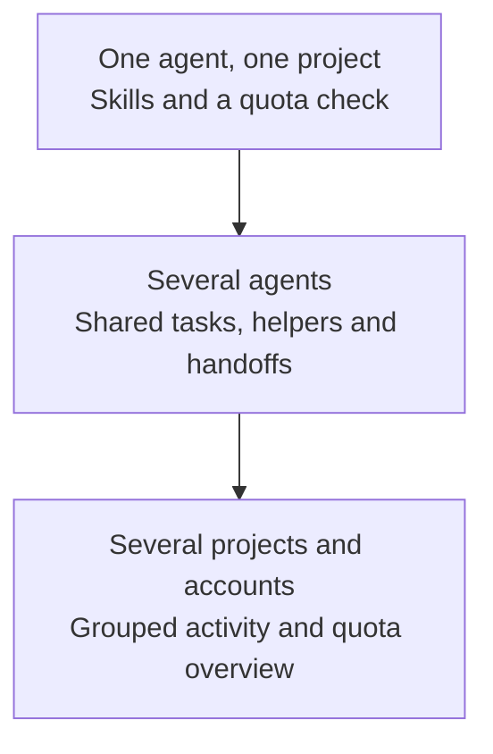

# As your work grows

Start with the pieces that help now. Additional agents, projects, and
accounts make coordination and visibility more useful; they do not require
you to adopt every tool.

  

## One agent

Use a skill to improve an investigation or review. Check quota when planning
long work. Neither shared records nor always-loaded rules are required.

## Concurrent agents

Let agents claim tasks and coordinate prerequisites. Fold parent/helper
groups to scan the overview; expand them to inspect busy delegates and waits.
Keep your decision list separate from their queue.

## Several projects and accounts

The overview works best on a single machine. Delegation across machines can
leave agent activity and usage attribution incomplete or stale, reducing
the accuracy and usefulness of the dashboard. Shared task records can help
coordinate work, but do not provide live visibility into every machine.

*Thirteen fictional agents across seven parent groups, with four quota
observations. Expand a group or filter tasks to inspect the work behind
the overview. [Open the full-size capture](assets/growing-dashboard.png).*

Use repository scopes to inspect a project, or see the shared queue across
configured records. Local activity can show sessions from different projects.
Quota reports distinguish account observations; check freshness, current
sign-in, and truncation before making capacity decisions. Archived account
readings do not guarantee current capacity. Account switching remains manual.

This describes supported workflows, not a tested maximum agent count or an
automatic account scheduler. Optional scheduling tools have explicit grant
and recovery boundaries; see the [agent-facing coordination reference](coordination.md).
