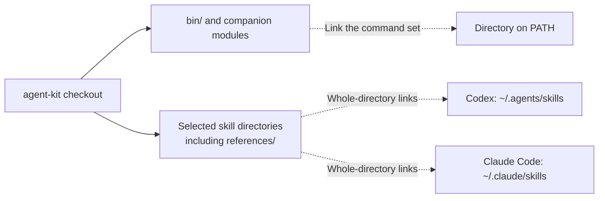

# Installation and integrations

[Back to the introduction](../README.md).

This is the setup reference for coding agents and manual configuration.
Before changing anything, establish which tools, skills and integrations
the user wants. Inspect the environment, preserve existing entries, and
explain conflicts rather than replacing them. Requirements below apply only
to the selected pieces; rules, hooks, summaries and shared records need their
own explicit choice. Finish by verifying the selected setup and giving the
user a first command or skill prompt.

## Requirements

- A POSIX shell. Developed on macOS; the shell scripts and Python target
  Linux equally, and platform-specific behaviour is gated rather than
  assumed.
- **Python 3.9+** for `agent-quota`, `agent-status` and their modules. No
  third-party packages.
- **[uv](https://docs.astral.sh/uv)** for `md-preview`, which is a PEP 723
  script: uv resolves its pinned dependencies per invocation. Without it the
  wrapper says so and exits 127.
- `git` — required for the records commands and `steamos devkit install`.
- `steamos` needs Python 3.9+, `ssh`, `rsync` and `git` on the host. The
  device uses SteamOS's own Python 3. No host Python installation is copied
  to it. `scp` is needed to download captures and measurements. See the
  [SteamOS guide](steamos.md) for Developer Mode, pairing and device setup.
- `tmux` — required only for `agent-dash`; `taskglance` is optional with
  `agent-dash --personal`. The default uses no model summaries.
- An authenticated `claude` or `codex` CLI for `agent-quota` to report on.
  It reports what it can observe and leaves the rest unknown.
- Speech is optional: `say` on macOS, `spd-say` or `espeak-ng` on Linux.
  Without one, `agent-speak.sh` falls back to a terminal bell.

`agent-speak.sh --bell --attention needs-you 'needs a decision'` uses a
terminal bell instead of speech. Attention reasons are `needs-you` (YOU),
`blocked` (BLOCKED), `work` (WORK: ready for work with no active delegates),
and `check` (CHECK: concrete evidence warrants investigation). Ordinary
messages default to `needs-you`. In tmux, a bell rings once when the reason
changes, through the exact pane's terminal even when tool output is captured
and the worker has no controlling terminal.
Mute suppresses audio while retaining the badge. No transcript silence or
turn completion is interpreted as a blocker or empty work queue.

`agent-speak.sh --clear` clears the current pane's badge. Configure
`agent-attention hook` on SessionStart and UserPromptSubmit to clear it when
the main session resumes (compact and identified subagent events are ignored).
The helper publishes `@agent_attention`, `@agent_attention_mark` and
`@agent_attention_kind` pane options; it preserves pane titles/window names.
Tmux formats can display these directly and loop over panes for window badges.
Outside tmux no pane is guessed or registered. Missing tmux fails silently.
Agents must clear resolved attention; a badge is a reported hand-off, not
proof of a running process. Dead panes are excluded from dashboard totals.

## Install

Clone anywhere, then link the pieces you want.



Choose either or both agents' skill destinations. Links point back to the
checkout, so keep it in place. Rules and hooks remain separate opt-ins.

```sh
git clone git@github.com:kindjie/agent-kit.git ~/src/agent-kit
cd ~/src/agent-kit
```

**Commands.** Link the whole `bin/` directory, not individual files.
`claude-ctx.sh`, `claude-status.sh` and `md-preview` locate their siblings
through the path they were invoked by, so a partial link fails at runtime
rather than at install time. The records commands also work when linked
individually because they resolve their Python modules through real paths.

```sh
mkdir -p ~/bin/agent-kit
for source in "$PWD"/bin/*; do
  [ -f "$source" ] || continue
  target="$HOME/bin/agent-kit/${source##*/}"
  if [ -e "$target" ] || [ -L "$target" ]; then
    printf 'Existing entry, skipped: %s\n' "$target"
  else
    ln -s "$source" "$target"
  fi
done
```

Then add it to `PATH` in your shell profile:

```sh
export PATH="$HOME/bin/agent-kit:$PATH"
```

**Skills.** Link whole skill directories, so their `references/` travel with
them. Claude Code reads `~/.claude/skills`; Codex reads `~/.agents/skills`.

```sh
mkdir -p ~/.claude/skills ~/.agents/skills
# Select names; installing every skill is optional.
for name in profiling commit; do
  skill="$PWD/skills/$name"
  for directory in "$HOME/.claude/skills" "$HOME/.agents/skills"; do
    target="$directory/$(basename "$skill")"
    if [ -e "$target" ] || [ -L "$target" ]; then
      printf 'Existing entry, skipped: %s\n' "$target"
    else
      ln -s "$skill" "$target"
    fi
  done
done
```

### Profiling-only installation

Link the whole skill directory so its references remain available. This
needs neither tmux nor records, and it does not install profiling tools.
From the checkout, for Codex:

```sh
mkdir -p "$HOME/.agents/skills"
destination="$HOME/.agents/skills/profiling"
[ ! -e "$destination" ] && [ ! -L "$destination" ] && \
  ln -s "$PWD/skills/profiling" "$destination"
```

For Claude Code, use `$HOME/.claude/skills` for the destination instead.
The guard refuses an existing entry, including a dangling link. Inspect
it before deciding whether to replace it; keep the checkout in place.
Skill selection depends on the agent and request, so installation does not
guarantee automatic invocation. See the supported paths and symlink behavior
in [Codex's documentation](https://learn.chatgpt.com/docs/build-skills#where-codex-loads-local-skills)
and [Claude Code's documentation](https://code.claude.com/docs/en/skills#choose-where-skills-load).

### SteamOS-only installation

From the checkout, link `steamos` and its whole skill directory. The command
resolves its sibling Python modules through its real path. This setup needs
neither the dashboard nor shared task records. For Codex:

```sh
mkdir -p "$HOME/bin" "$HOME/.agents/skills"
command_target="$HOME/bin/steamos"
skill_target="$HOME/.agents/skills/steamos"
if [ -e "$command_target" ] || [ -L "$command_target" ]; then
  printf 'Already exists: %s\n' "$command_target"
else
  ln -s "$PWD/bin/steamos" "$command_target"
fi
if [ -e "$skill_target" ] || [ -L "$skill_target" ]; then
  printf 'Already exists: %s\n' "$skill_target"
else
  ln -s "$PWD/skills/steamos" "$skill_target"
fi
steamos --help
```

For Claude Code, use `$HOME/.claude/skills` as the skill destination.
Inspect an existing entry before replacing it, and keep the checkout in
place. Device setup is separate: `steamos doctor` checks local prerequisites
without connecting, while `steamos doctor --device NAME` checks one device.

Governor pinning for `steamos bench run` is optional. It requires an
owner-installed, root-owned helper and a narrow sudoers rule on the device.
The sudoers filename must sort after `wheel`; see the
[governor helper instructions](
../bin/steamos.md#optional-governor-helper-and-sudoers-rule).
An unpinned benchmark needs no sudo.

### Verify the selected setup

**Check command discovery.** Help needs no account or model call:

```sh
agent-quota --help
agent-dash --help
```

**Check selected skills.** Confirm each destination resolves to its checkout
directory and that `SKILL.md` and any supplied references are readable.
Give the user a starter prompt that names their chosen skill.

Markdown preview is optional and needs `uv`; it starts a loopback server:
`md-preview README.md --no-open`. See the preview skill for asset-serving limits.

## Always-loaded rules

Several skills defer to rules that bind regardless of which skill is
running: what blocks a commit, when to re-read review comments, what
reasoning effort to default to. Each skill states a usable default, so it
works with nothing installed. To make those rules bind everywhere rather
than only when a skill triggers, add them to your agent instructions with
`agent-kit-rules`:

```sh
agent-kit-rules --dry-run   # show what would change
agent-kit-rules             # ~/.claude/CLAUDE.md and ~/.codex/AGENTS.md
agent-kit-rules path/to/AGENTS.md   # or name the files
```

It writes [`AGENTS.snippet.md`](../AGENTS.snippet.md) into each file between
`BEGIN agent-kit` and `END agent-kit` markers, appending it when absent.
Read it first — it is short, and it asserts opinions about testing and
pushing that you may not share. Your own rules take precedence wherever
they conflict; the skills say so. By default it updates only the files of
the agents present (`~/.claude`, `~/.codex`), follows symlinks to the real
file, keeps its permissions, and replaces it atomically.

The task and changelog rules are included only when `agent-task doctor`
and `agent-changelog doctor` both pass at install time (see
[Agent records](records.md#agent-records)); agents then read whether the tools apply
rather than each running the checks. The doctors may open a git signing
prompt. Output says why the section was left out, and `--records on|off`
overrides the check. Re-run `agent-kit-rules` after configuring the
records tools or updating agent-kit.

Re-running is safe, and the snippet may be moved anywhere in the file: it is
replaced where it stands. The BEGIN marker records a hash of the installed
text, so a snippet you have edited is refused and left as it is (`--force`
replaces it; `--dry-run` shows the difference). Snippets appended by the
earlier README loop are recognised as unedited. Markers count only at the
start of a line and outside fenced code, so documentation that shows them is
left alone. Duplicate, missing or out-of-order markers are refused; fix them
by hand. So are files that are not UTF-8, symlink loops and dangling links,
and a file that changes while it is being updated. Line endings are kept,
CRLF included. The exit status is 1 when any file was refused.

## Records hooks

Always-loaded rules say when to record work and state; a hook makes the
moment hard to miss. `agent-records-hook` adds a one-line reminder after a
shell command that creates lasting state (a worktree, stash, new branch,
tool install or service), and at session start tells the agent its records
ID, the tasks it holds, open tasks and open changelog entries for the
repository. It only adds context, never blocks, and stays silent when the
records tools are not configured. Claude Code, in `~/.claude/settings.json`:

```json
"hooks": {
  "PostToolUse": [{"matcher": "Bash", "hooks": [{"type": "command",
    "command": "$HOME/bin/agent-kit/agent-records-hook post-tool"}]}],
  "SessionStart": [{"hooks": [{"type": "command",
    "command": "$HOME/bin/agent-kit/agent-records-hook session-start",
    "timeout": 20}]}]
}
```

Codex uses the same schema in `~/.codex/hooks.json`, with
`--provider codex` added to both commands so the agent ID matches
`agent-id show`.

## Status lines

**Claude Code** — in `~/.claude/settings.json`:

```json
"statusLine": {
  "type": "command",
  "command": "$HOME/bin/agent-kit/claude-status.sh",
  "refreshInterval": 2
}
```

**tmux** — in `tmux.conf`, using an explicit path. A `PATH` change does not
reach a tmux server that is already running, so a lookup by name leaves the
component blank until the server restarts:

```tmux
set -g status-right "#($HOME/bin/agent-kit/claude-ctx.sh #{window_id} #{client_width})"
```
