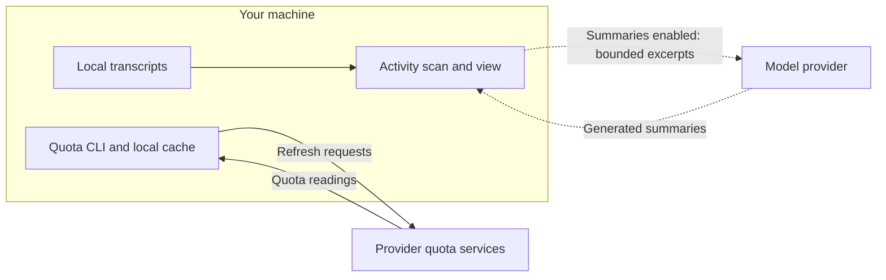

# Privacy and observation limits

[Back to the introduction](../README.md).

## What it reads, and what leaves the machine

`agent-quota` scans the Claude Code and Codex transcript directories on this
machine to attribute token activity. That scan uploads nothing.

Quota refreshes contact provider services. The model provider can differ from
the thread's original provider; the dashboard disables summaries by default.

When summaries are enabled, `agent-quota --agents` can label threads by
sending a bounded excerpt of the thread to a model. By default the
eligible providers include the one that did not produce the thread, so a
Claude Code excerpt can be sent to Codex and the reverse, spending that
provider's quota or credits.

- `--no-cross-provider-summaries` keeps each excerpt with its own provider.
- `--no-summaries` updates observations and makes no model calls.
- `--cached` skips the transcript scan entirely.
- `AGENT_QUOTA_SUMMARIZER=1` in the environment suppresses labelling without
  a flag.

`md-preview` serves the document's own directory on loopback. Passing
`--repository-assets` widens that to the enclosing repository, which makes
every sibling readable by any local client for as long as the server runs.
Version-control directories are never served.
