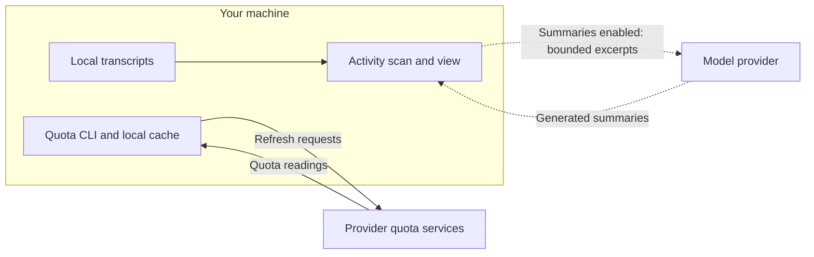

# Privacy and observation limits

[Back to the introduction](../README.md).

  

## What it reads, and what leaves the machine

`agent-quota` scans the Claude Code and Codex transcript directories on this
machine to attribute token activity. That scan uploads nothing.

Quota refreshes contact provider services. The model provider can differ from
the thread's original provider; the dashboard disables summaries by default.

When summaries are enabled, `agent-quota --agents` can label threads by
sending a bounded excerpt of the thread to a model. By default the
eligible providers include the one that did not produce the thread, so a
Claude Code excerpt can be sent to Codex and the reverse, spending that
provider's quota or credits.

- `--no-cross-provider-summaries` keeps each excerpt with its own provider.
- `--no-summaries` updates observations and makes no model calls.
- `--cached` skips the transcript scan entirely.
- `AGENT_QUOTA_SUMMARIZER=1` in the environment suppresses labelling without
  a flag.

`md-preview` serves the document's own directory on loopback. Passing
`--repository-assets` widens that to the enclosing repository, which makes
every sibling readable by any local client for as long as the server runs.
Version-control directories are never served.

## SteamOS devices

`steamos` keeps device configuration in
`$XDG_CONFIG_HOME/agent-kit/steamos.json`, a pinned Devkit source cache in
`$XDG_CACHE_HOME/agent-kit/steamos-devkit/`, and optional per-user project
build overlays in `$XDG_CONFIG_HOME/agent-kit/steamos-projects/`. Local
captures, frametime CSVs and benchmark copies go to the paths you choose.
Keep private input paths in the overlay rather than a public project config.

On each device, it uses a lease directory and lease log in the user's home.
It records title launch times in `~/.agent-kit-steamos-launches`, benchmark
runs in `~/.agent-kit-steamos-bench/`, Devkit titles under `~/devkit-game/`,
and versioned deploys inside each managed title. Devkit helpers live in
`~/devkit-utils/`. Bench runs are retained until later runs prune them
according to the configured count; see the
[command reference](../bin/steamos.md#benchmarks).

Device commands cross the network by ssh to your configured devices; wake
uses a local-network UDP broadcast. The first Devkit helper install for a
pin fetches Valve's GitLab repository at that commit, unless you configure
a different source. The command sends no data to any other service. Your
agent or build command may have its own network behaviour.
