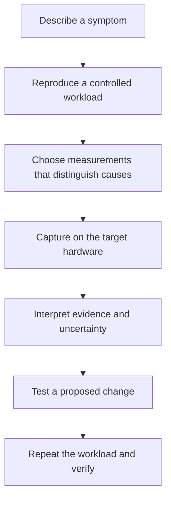

# Investigate performance with evidence

The profiling skill helps your agent choose useful measurements before
changing code. It covers CPU work, GPU timing, WebAssembly, and parallel
scaling. You choose the problem and authorize the captures; the agent
checks available tools and explains what the evidence can establish.



## Start with a request


```text
Use the profiling skill to investigate uneven frame pacing when the
Moss & Muggs tea shop is full. Establish a reproducible workload, check
available tools, and distinguish CPU work, GPU work, and waiting.
Do not propose an optimization from source inspection alone.
```

*An illustrative request, not a transcript or measured performance result.*

Install only this skill if that is all you need: use the
[setup prompt](../README.md#quick-start) and choose profiling alone.
It does not require task records or the dashboard and does not install
profilers. Some captures need interactive tools or hardware access;
unavailable evidence should remain an explicit limit.

Give your agent the [profiling skill](../skills/profiling/SKILL.md),
[CPU diagnosis](../skills/profiling/references/diagnosis.md), or
[GPU diagnosis](../skills/profiling/references/gpu-diagnosis.md).
