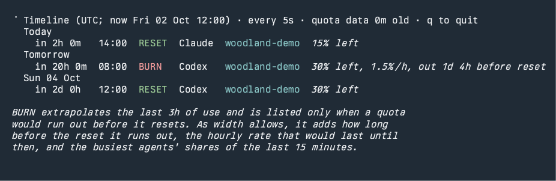

# Understand quota and resets

Quota views help you and your agents plan consumption across the accounts
you use. You control sign-in and account switching; agent-kit does not
switch credentials for you.

<p align="center">
  
</p>



*Authored fictional observations, not account balances or promises of capacity.*

**RESET** is an observed quota reset time. **BURN** is a projection: recent
consumption would run out before that reset. A change in workload changes
the projection. Subscription allowance and purchased credits are separate.
Unknown readings or forecasts mean insufficient observations.


```text
Help me understand my agent quota. Check the currently authenticated CLI
account, explain remaining capacity and reset times, and distinguish
subscription quota from purchased credits. If the recent pace would run
out first, suggest ways to plan the work. Do not switch accounts or change
credentials, and keep model summaries off.
```

Your agent can explain the compact report or open the live timeline.
See [the command reference](../bin/agent-quota.md) for controls and limits,
and [privacy](privacy.md) for provider requests and transcript handling.
