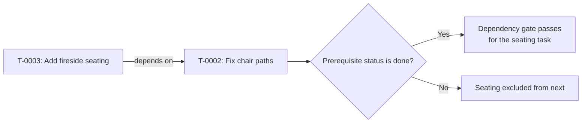

# Shared work records

[Back to the introduction](../README.md).

Shared records give concurrent agents one place to claim work, exchange
messages and preserve what happened. `agent-task` holds the work queue;
`agent-changelog` keeps lasting events and machine changes. You can follow
the queue through the read-only dashboard.

## Ask your agent to help with setup

```text
Help me set up agent-kit's shared tasks and event logs. Read
docs/records.md first. Check existing configuration and ask where I
want the two dedicated Git record stores. Preserve existing data and
configure only the stores I choose. Verify their access and signing,
then show me how to view the queue. Do not enable automatic pushing
or add global rules and hooks unless I choose those integrations.
```

The rest of this page is the technical reference for agents performing
setup and coordination, and for people who prefer manual configuration.

For a new, local starter queue, run:

```sh
agent-records init --default --machine my-workstation
```

`--machine` is optional; without it, setup records the current short hostname.
Git needs a commit identity (`user.name` and `user.email`); setup checks for
one, and for the refusals below, before it prints or creates anything. It then
prints its chosen paths and values, creates dedicated tasks and changelog Git
repositories under `${XDG_DATA_HOME:-~/.local/share}/agent-kit/`, then writes
`${XDG_CONFIG_HOME:-~/.config}/agent-kit/records.json` with absolute paths, the
machine name and `"push": false`. It refuses existing configuration, records
directory destinations, or nonempty `AGENT_TASKS_DIR`, `AGENT_CHANGELOG_DIR` and
`AGENT_MACHINE` overrides. It never changes existing configuration or mints an
agent ID. If the second store or the configuration write fails, the stores
already created remain and the command prints manual recovery guidance; it will
not overwrite them on retry. The starter queue is local. Agents on another
machine need explicit access to the same shared stores and a separately chosen
sync policy.

## Agent records

Tasks and changelog entries live in separate, dedicated git repositories.
Configure their roots with `AGENT_TASKS_DIR` and `AGENT_CHANGELOG_DIR`, or
put a `records.json` in `${XDG_CONFIG_HOME:-~/.config}/agent-kit/`:

```json
{
  "tasks_dir": "/path/to/tasks",
  "changelog_dir": "/path/to/changelog",
  "machine": "example-machine",
  "push": false,
  "estimate_policy": "off",
  "repos": {"/path/to/checkout": "example-repo"}
}
```

`--dir` overrides each directory's configured path. `AGENT_MACHINE` overrides
the machine setting. Without either, the commands use `hostname -s`, which
can change with network configuration; pin a stable machine name. There is no
implicit records directory selection. For custom or shared stores, initialize
each root once:

```sh
agent-task init /path/to/tasks
agent-changelog init /path/to/changelog
agent-task doctor
agent-changelog doctor
```

`init --adopt` accepts an existing records-only git repository. Other tracked
paths need a repeated `--allow PATH`; the marker records these exceptions.
Writers need both roots writable in an agent sandbox, including Git metadata,
lock and journal files. Readers open existing lock files read-only. `init`
creates them; run `doctor` after cloning records to provision missing locks.
`doctor` probes writability and tests git signing in a
temporary repository. It may open a signing prompt. The commands respect
the repository's signing settings and hooks; an executable commit or push
hook makes mutations refuse because it could change unjournaled files.

Task files are `T-0001-slug.md`, moving unchanged in name to `archive/` on
close. Their `key: value` header holds status, owner, claim expiry, helpers,
priority, severity, repository keys, review, links and related task IDs.
`## Known`, `## Plan`, `## Done when` and `## Log` follow. The four fixed
completion checks are merged, cleanup, docs and work-reviewed. A completed
task needs evidence for every applicable check. For work without repository
changes, create with `--no-changes` and mark inapplicable checks with
`check --na REASON`. `check` also takes an optional `--reason` to log;
checking an item again rewrites its evidence, and the owner can `uncheck
--reason` one ticked in error. Added checks can be selected by number or
their full text, including text with evidence markers. Digits select a
checklist number, so an all-digit check text must be selected by number.
Exact text wins over a `key:` prefix; ambiguous matches report their
numbers. Evidence and n/a values cannot contain ` -- evidence: ` or
`: n/a -- ` because those strings delimit the stored value; a checked
item is therefore selected by its full text up to the last marker. Older
checked lines whose stored value itself contains a marker cannot be told
apart from item text, so every selector refuses them; correct such a
line by hand. `uncheck` and
`reopen` require a non-empty `--reason`. The review field is separate from
the work-reviewed check. `agent-task --help` summarizes transitions; each
subcommand's `--help` describes its options.

Declare a prerequisite with `dependency add TASK PREREQUISITE`, or repeat
`new --depends-on PREREQUISITE` when creating a task. Revoke it with
`dependency remove TASK PREREQUISITE`. Dependencies are directional:
TASK depends on PREREQUISITE. Missing tasks, self-dependencies and cycles
are refused. These commands update only TASK and log the change; `--reason`
adds context. The owner may edit dependencies, or any agent when no live
claim exists. Helpers need the owner to make the change.

For example, seating needs the chair-path fix first:



The dependency arrow points from the dependent task to its prerequisite.
Passing this gate does not bypass other `next` filters or completion checks.

`agent-task dependency show TASK` lists its direct prerequisites and
dependents with their current status and title, including archived tasks.
Use `--json` for full task fields in `prerequisites` and `dependents` arrays.
`next` skips tasks until every declared prerequisite is `done`. Cancelled,
abandoned and superseded prerequisites remain unsatisfied; revoke or replace
those dependencies explicitly. Reopening a prerequisite makes it unsatisfied
again. Dependencies do not change task status or prevent explicit claims or
closure, so preparatory work can still proceed.
An invalid or missing prerequisite makes its candidate unavailable, with a
warning on stderr; other candidates remain eligible. A relationship view
with unreadable or malformed unrelated records is marked `UNVERIFIED`
(`authoritative: false` in JSON) because its dependent list may be incomplete.
Run `lint` to diagnose graph errors after reconciling records from other clones.

### Live task view

```sh
agent-task list --live
agent-task list --live --here
agent-task list --live --repo example --interval 1
```

The read-only terminal view refreshes verified local records every two seconds
by default (minimum interval 0.1 seconds). It includes live tasks and tasks
closed in the last hour; `--all` includes older closed tasks and `--archived`
shows closed tasks only. Existing status, owner and repository filters apply.
Without a usable input/output terminal it prints one plain snapshot and exits.
Interactive mode uses Python's standard-library curses on macOS and Linux.

| Keys | Action |
| --- | --- |
| `j` / `k`, Down / Up | Select next / previous task |
| `gg` / `G` | Select first / last task |
| Ctrl-d / Ctrl-u | Move half a page |
| `/` | Filter IDs, titles, repositories, owners and states without case |
| Enter | Keep the filter, or expand/collapse task details |
| Tab | Show progress, dependencies, evidence or observed waits |
| `[` / `]`, Ctrl-k / Ctrl-j | Scroll detail lines up / down |
| `f` | Toggle full-screen / split details |
| Mouse wheel / click | Scroll list or details / select a task row |
| `?` | Help; `?` or Esc closes it |
| Esc | Clear an edited filter, cancel a key sequence, or close details |
| `q` / `ZZ`, Ctrl-C | Quit |

The Observed waits tab reads the existing local agent cache and shows wait
conditions and observation age. Coverage is incomplete by nature; missing
observations never mean zero watchers. Use `--agent-cache-file PATH` with
`--live` to select another cache. No collector or session scan runs here.

For collapsible parent/subagent groups, use `agent-quota --agents --live`.
The live default is 100 parent groups with their observed subagents; groups
start collapsed. Rows lead with recorded session titles when available;
IDs, activity and descendant summaries occupy a separate column.
Click selects an agent row; click its fold marker to toggle its group.
Wheel over the list moves selection; wheel over details scrolls those details.
Interactive views share a neutral inverse selection and a `>` gutter;
`▸`/`▾` mark collapsed/expanded agent groups. View headings come first,
with compact information below and subdued control hints in the footer.
Space toggles a group, Left/Right navigate the hierarchy, and Enter shows
observation details. Rows distinguish ended turns, explicit waits, reasoning
and tool calls, with descendant activity visible even when collapsed.
See [agent-quota](../bin/agent-quota.md) for the evidence and freshness limits.

Filter editing supports UTF-8, arrows, Home/End, Ctrl-a/e, Backspace,
Ctrl-w to remove a word and Ctrl-u to clear. Selection follows the task ID
across updates; selected titles wrap, with an ellipsis when space runs out.
Scrolling reserves the whole selected title block, including wrapped lines.
The header uses two rows for verification and work health; eligibility and
change-window counts are available in help and progress details. Task and agent
help groups keys by function; j/k, arrows and Ctrl-d/u scroll, gg/G jump to
the first/last help page, and ? or Esc closes it. At 101
columns or wider, Updated shows relative age (`5m ago`, `13h ago`, `2d ago`).
The wide layout places SP, Est tokens and Est time immediately after the ID;
these use the selected model only. Missing estimates show `—`, never zero. Details
retain the full timestamp and timezone. That timestamp comes from the task log (or
creation when no log exists), separately from snapshot verification. Colour
distinguishes states and warning flags; `NO_COLOR` disables it.
Tasks group by state, then priority and ID. Mutating taskglance keys are not
assigned: the dashboard cannot edit, claim, close, delete or undo tasks.

Changed rows are bold for ten seconds. Event badges last five minutes and
recent closures remain visible for one hour. The recent strip distinguishes
creation, completion, reopening, cancellation, supersession, rewritten logs
and prerequisites becoming satisfied. The initial snapshot establishes a
baseline rather than announcing every existing task as new. A disappeared
task is never counted as completed. Changes entirely undone between polls
cannot be observed. Session totals cover all repositories; health counts
follow CLI filters, and `/` filters only the list. Event history is bounded
and kept in memory, so restarting resets session counts.

The header shows recorded states, expired claims, owner holds, eligibility
under the existing `next` rule, recent completions and estimate coverage.
Owner holds remain separate from `next` eligibility, whose existing rule
does not interpret that field. A valid claim does not prove an agent is
running; an expired one does not prove work stopped. The last-record age
measures recorded activity, not productive progress. Completion checks show
counts and recorded evidence, not a percentage of effort or freshly queried
CI results. Dependency details include records outside the selected scope;
only `done` satisfies a prerequisite. Missing dependencies stay unsatisfied.

Time estimates are for the selected model's participation, not a task finish
forecast. Zero is a known estimate; absent estimates remain unknown. The view
does not add overlapping model estimates, turn points into hours, infer
remaining work from elapsed time, or invent completion ETAs. An owner hold
is labelled explicitly. Details include the recorded reason for unknown time.

Refresh errors keep the last good snapshot behind a `STALE` banner with its
verification time. The reader never repairs pending journals, writes cache or
record files, synchronizes Git, scans transcripts or calls models. Locks are
held only during snapshots, with a short bounded wait. `--unlocked`, `--json`
and `--with-changes` cannot be combined with `--live`. Keyboard input, screen
and cursor are restored on normal exit and SIGINT, SIGTERM or SIGHUP.

Record estimates against exact model IDs:

```sh
agent-task --agent helper estimate set T-0001 provider/model-v1 \
  --wall-seconds 600 --tokens 20000
agent-task --agent helper estimate set T-0001 provider/model-v1 --tokens 25000
agent-task --agent helper estimate remove T-0001 provider/model-v1 \
  --reason 'no longer considered'
agent-task --agent helper set T-0001 --storypoints 5
```

The optional `estimates` header is a JSON object keyed by model ID, with
`wall-seconds` (finite, nonnegative elapsed seconds) and `tokens`
(nonnegative integer total tokens), or nonblank `wall-seconds-unknown` and
`tokens-unknown` reasons in place of numeric values. At least one metric or
unknown reason is required for `set`; omitted metrics and other models are preserved. `remove` revokes the
model's whole estimate. These are manual planning estimates, not measured
usage. Estimate edits have the same permissions as dependency edits.
`storypoints` accepts only 1, 2, 3, 5, 8, 13 or 20 through `new` or `set`;
an empty field means unspecified. Storypoints edits follow the existing
owner-only field editing policy for claimed tasks. Older records without
these optional headers remain valid; no migration is required.
Use `agent-task --agent <id> log TASK 'rationale or scope change'` for brief
estimation context.
The `estimate-agent-work` skill provides sizing and decomposition guidance;
it does not require estimating the existing backlog. Executable pieces are
ordinary tasks. Associate them with
`agent-task --agent <id> link TASK --related OTHER_TASK`. Declare real blockers
with `agent-task --agent <id> dependency add TASK PREREQUISITE`, adding
`--reason 'result needed'` to explain the prerequisite.

Set the per-machine `estimate_policy` in `records.json` to `off` (default),
`warn` or `require`. At claim/extension, handoff, helper registration and
resumption into `in-progress`, `warn` prints missing execution estimates;
`require` refuses without changing
the task. Creation and closure remain unaffected, with no backlog migration
or storypoint gate. Select the intended model when claiming or handing off:

```sh
agent-task --agent helper estimate set T-0001 provider/model-v1 \
  --wall-seconds 600 --tokens-unknown 'context size not yet known'
agent-task --agent helper claim T-0001 --model provider/model-v1
agent-task --agent helper claim T-0002 \
  --model-unknown 'runtime does not expose its model ID'
```

Both metrics must have a numeric value or a nonblank unknown reason for the
selected model. Use `--wall-unknown REASON` and `--tokens-unknown REASON` on
`estimate set`; each replaces its numeric value, and a later numeric estimate
replaces that reason. Unknown values are never converted to zero. A recorded
unknown model reason acknowledges that neither metric can be keyed reliably.
These reasons are explicit exceptions, not verified predictions.

The optional `execution-model` and `estimate-model-unknown` task headers store
the selection. Renewals by the same recorded owner reuse it, even after expiry; takeovers and
handoffs need a fresh selection or explanation. Estimates for unrelated
models do not satisfy the check and are never used to infer a selection.
Warnings show commands for recording resources and choosing the model.

For a new task, combine creation, estimates and ownership in one transaction:

```sh
agent-task --agent helper new --title 'Example task' --storypoints 3 \
  --claim --model provider/model-v1 --wall-seconds 600 --tokens 20000
```

`new --claim` accepts `--hours` (default 2, maximum 24). Without `--claim`,
startup options are rejected. Missing required estimates or invalid input
leave no task, allocation or commit behind. Use `--model-unknown REASON` alone
when the model is unavailable. For a known model, the same numeric or unknown
metric options as `estimate set` are available. Existing `claim` accepts those
options too; same-owner renewals can update metrics for their retained model.
Omitted metrics are preserved, and takeovers never inherit a model selection.
Helper registration remains explicit and separate from owner selection.

Register each helper's intended model separately, after recording its
per-model estimates:

```sh
agent-task --agent owner estimate set T-0001 provider/worker-v1 \
  --wall-seconds 300 --tokens 5000
agent-task --agent owner helper add T-0001 helper-id \
  --model provider/worker-v1
```

`helper add` also accepts `--model-unknown REASON`. Repeating it reuses the
helper's previous selection unless a new selection is supplied. The optional
`helper-models` JSON header maps helper IDs to `{"model":"ID"}` or
`{"unknown":"reason"}`; it never changes the owner's selection. Estimates
remain task-wide per-model entries, not separate per-helper budgets. Removing
a helper clears its selection; release, takeover, handoff and closure clear
all helper registrations and selections. Same-owner renewal after expiry keeps
helpers and their selections unless another agent has taken ownership.
The policy checks these task transitions, not whether arbitrary work outside
the tool actually started, and does not validate estimate accuracy.
Implicit claim heartbeats on ordinary task edits are not rechecked; this is
a start/resume check, not continuous enforcement. Other machines can use a
different policy. Invalid policy configuration is refused by all commands.

Like all header values in `show --json` and `list --json`, `estimates` is
returned as a string; decode that string as JSON to read its model entries.

Changelog entries are `entries/YYYY-MM-DD-HHMM-scope-slug.md`; mistakes are
`mistakes/YYYY-MM-DD-slug.md`. Their headers record the event, location,
reason, cleanup plan, repository keys and associated task IDs. The `tasks:`
field is the association authority: tasks do not duplicate it. Open records
must be closed, mitigated or transferred before their last task closes.
An entry's `location:` is one or more paths beginning with `~/`, `/`, `./`
or `../` (or the corresponding single directory marker). Separate paths with
`; `; a parenthesized note may follow a path. Brace lists such as
`~/git/{repo-a,repo-b}` expand to paths; nested lists are accepted as
written. A `host:` prefix (`device:~/game`) names a path on another machine.
Entries whose kind includes `service` or `other` may name non-path places,
such as a port or a cloud project, and are not checked. The parser also
accepts newline
separators in existing records; CLI writers keep headers on one line. Use
repository keys, rather than absolute checkout paths, in `repos:`.
`agent-changelog lint` prints `WARN` for open entries with unparseable
locations, empty `repos:` when the scope names a known repository, or
absolute paths in `repos:`. Warnings alone exit 0; existing lint errors
retain their exit codes. `new` and `update --location` print the same
location warning to stderr but still save the entry, so older forms can be
repaired without blocking other record edits.
`agent-changelog update` and `mistake update` accept repeated `--add-task`,
`--remove-task`, `--add-repo` and `--remove-repo` options. All requested edits
are validated before writing; removing tasks from an open record must leave
another live task. `agent-task close ... done --transfer TARGET` moves open
records to a live target while closing the completed task and logs the move
on the target. The target's owner inherits them, even when another agent
holds the target, so agree a transfer with that owner first. Without
`--transfer`, close or transfer those records first. A failed
single-repository mutation reports verified rollback when records are
unchanged; resolve the reported error before retrying. The tool does not
automatically retry failed commits.
Records document state but never authorize deleting it.

Give each writer an explicit identity. `agent-id new helper` mints and
stores one for a delegated agent, together with the session that minted it.
An in-process subagent shares its parent's session variables, so without an
explicit ID every implicit lookup returns the parent. Two separate rules
apply:

- Records writes (`agent-task`, `agent-changelog`): `--agent ID`, then
  `AGENT_ID`. The session is never consulted; with neither, the write is
  refused.
- Implicit lookups (`agent-id show`, the `steamos` lease holder): an
  explicit `--holder` (steamos only), then `AGENT_ID`, then the
  session-derived ID. `steamos` has more sources; see the lease section of
  `bin/steamos.md`.

A malformed `AGENT_ID` is refused (exit 2) rather than ignored; an empty one
counts as unset. `AGENT_ID` leaks into nested CLIs, so `agent-id show` and
`steamos` honour it only when the current session is the one that minted
it (a subagent passes; a nested `claude -p` or `codex exec` has its own
session and falls back to its own ID, printing a one-line notice on
stderr). An ID bound to a session is also ignored, with the notice, when
the current process has no session variable, or when variables from more
than one provider are set (for example a Codex child that inherits
`CLAUDE_CODE_SESSION_ID`): variable precedence does not show which session
is current, so the safe choice is to require `--agent`/`--holder`.

With no usable `AGENT_ID` and variables from several providers set,
`agent-id show` refuses (exit 1, nothing printed) rather than name the
outer session by precedence. Neither Claude Code nor Codex sets a variable
only the innermost process has: a `codex exec` child of Claude Code sees
`CLAUDE_CODE_SESSION_ID`, `CLAUDE_PID` and its own `CODEX_*` together, and
a Claude child of Codex inherits `CODEX_THREAD_ID` the same way. Process
ancestry could name the nearest agent, but sandboxes hide `ps` and wrappers
rename processes, so it is not relied on. `agent-id new` still works there
and binds the ID to the whole mixed context (every set session variable,
hashed): `AGENT_ID` is honoured only where that exact context recurs, and
ignored with the notice when either provider's session changes or another
nesting level adds a variable. `steamos` skips `agent-id show` in that
case, prints a notice, and uses
`user@host`. An ID that is not in the registry, or whose registry row has no
minting session (older or sessionless mints), is trusted. Start a nested
CLI with `env -u AGENT_ID` and give it its own ID with `--agent`. A
cross-tool delegate (`claude -p`, `codex exec`) handed a coordinator-minted
ID has its own session, so `AGENT_ID` is ignored there: it must pass
`--agent`/`--holder` explicitly. The delegating agent can pass this prompt fragment:

```text
Your agent ID is helper-0123456789abcdef. Work on T-0001.
Start each shell call with `export AGENT_ID=helper-0123456789abcdef;` (the
variable does not persist between calls, and a one-off prefix covers only
the first command of `a && b`) so implicit lookups such as steamos use it,
and pass --agent helper-0123456789abcdef to every records mutation. `--holder helper-0123456789abcdef` works on every steamos command.
Start nested claude or codex sessions with `env -u AGENT_ID`.
Use agent-task --agent helper-0123456789abcdef log T-0001
  --to all 'Progress update' for coordination.
```

Agents sharing a task may use `helper add`, `log --to`, `show --after` and
`watch --for` to exchange messages. `watch` prints a cursor to resume from;
after a log rewrite, scan the full log it prints before resuming. Every
mutation requires `--agent` or `AGENT_ID`; inherited session variables do
not silently grant the parent's identity. `--force REASON` is only for the
human owner's explicit instruction, quoted or cited in the reason. It never
bypasses a completion gate; close as `cancelled` or `superseded` with a reason
when completion is not appropriate.

Exit codes are 0 success, 1 refusal with records verified unchanged,
2 usage or configuration error, 3 committed locally but push failed,
4 watch timeout, and 5 recovery needed or git operation in progress. A
mutation commits with explicit paths. `push` defaults to false, including
for `sync`. It may be set per directory, for example
`"push": {"changelog": true}` to push changelog records while tasks stay
local. When pushing, pushes hold the records lock, so readers and
watch polls can wait behind them. A failed rebase is aborted and reported;
resolve conflicts manually. If two machines allocate the same task ID and
`.next-id` conflicts, renumber the local task file and its `id:`, `related:`
references and changelog `tasks:` values, then run both `lint` commands.
Never use a records entry itself as permission to remove a worktree or file.

Ordinary reads and watches never invoke recovery or signing. A pending journal
makes them exit 5 without changing records; use an explicitly authorized
`agent-task --agent ID recover` or `agent-changelog --agent ID recover`.
Mutations retain automatic recovery before applying their own transaction.
`--unlocked` permits a diagnostic read of pending state marked `UNVERIFIED`
(`authoritative: false` in JSON); it cannot establish completion or ownership.
A live writer may still hold a lock: readers wait up to `--wait` rather than
inspect its in-flight transaction. Do not delete its lock or launch competing
recovery operations. `doctor` and explicit recovery are mutating operations.
If a wait reports `last writer`, that process has exited; a shared reader may
still hold the lock.
