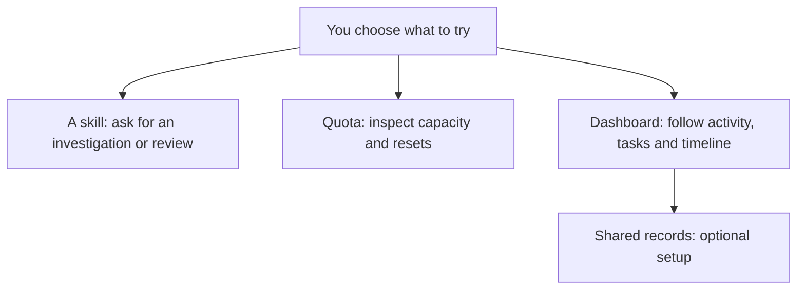
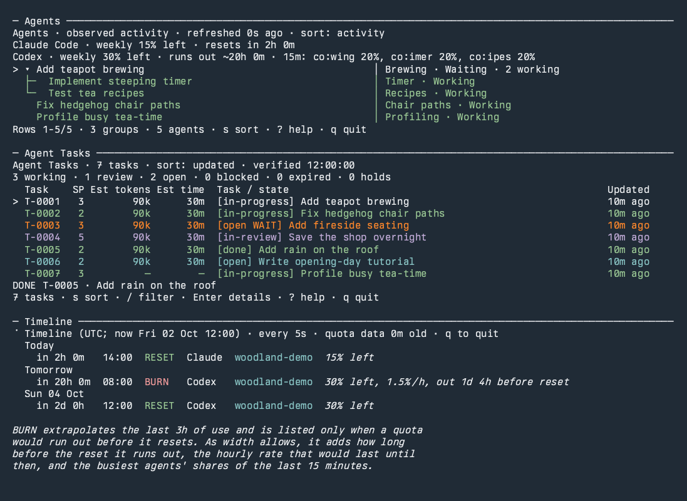

# Start with your coding agent

You can use agent-kit a piece at a time. Start with a useful skill or a quota
check; shared records and global instructions can wait.

## Working from a desktop app?

Paste the setup prompt from the [introduction](../README.md#quick-start)
into your coding agent. An app with local file and command access can help
inspect and configure your machine. If it cannot run local commands, ask it
to explain the steps and guide you through them. Desktop access alone does
not guarantee that the required Claude Code or Codex CLI is installed or
signed in; the setup agent should check.

You choose the integrations. The agent should preserve your settings,
explain conflicts, and verify only the pieces you choose.

## Your first successful use

- **Skills:** ask for the profiling skill and receive a measurement plan.
  A skill provides guidance; it does not install a profiler.
- **Quota:** see remaining capacity and reset times for an authenticated
  CLI. Missing data stays unknown. This check contacts your provider.
- **Dashboard:** see Agents, Agent Tasks, and Timeline in a terminal.
  Task setup may be unconfigured; that is expected before records setup.

*Fictional Moss & Muggs data. Your own view will reflect available observations.*

## Moving around and leaving

Select a pane with the mouse when your tmux setup permits it, or ask the
setup agent to show your tmux pane-switching keys. In Agents and Agent Tasks,
`?` opens help. In any live view, `q` exits. In task details, Esc closes
the details.
The unconfigured task pane is a setup message rather than a live view.

For a complete practice environment, ask your agent to launch the
[fictional demo](demo/README.md). It uses isolated data without accessing
your accounts or projects. Want terminal help? See [the optional guide](terminal.md).

## Something looks wrong?

Tell your setup agent which command you tried and what happened. Ask it to
inspect the relevant setup without changing settings or credentials first.
Do not paste tokens, credentials, or private transcripts into a public issue.
The [setup reference](install.md) is written for the agent doing that work.
