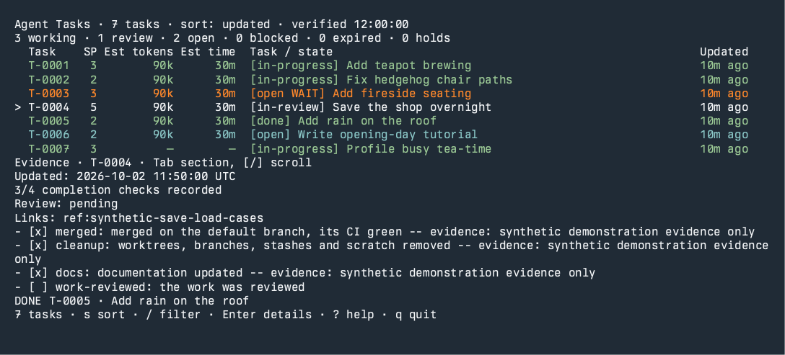
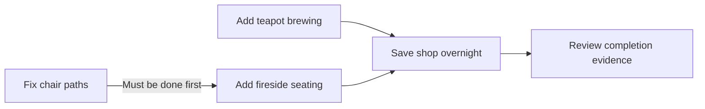

# Coordinate work across agents

Agents share a queue of tasks with owners, helpers, dependencies, and
completion evidence. You set the goals and resolve decisions needing you;
the agents manage their work through those records.



*Fictional Moss & Muggs records. Recorded evidence is not a fresh CI result.*

## Dependencies explain the order



*Illustrative project plan. Only a prerequisite marked done satisfies a
recorded dependency; a running or in-review task is still outstanding.*

## Keep owner decisions separate

The agents' queue is `agent-task`. Your personal list can use
[taskglance](https://github.com/kindjie/taskglance) for work needing you.
A task lease expiring does not establish that work stopped, and an estimate
is not an ETA. Ask the responsible agent when the records need clarification.


```text
Help our agents coordinate this project. Inspect existing task records
first. Propose ownership, dependencies, and a useful breakdown, keeping
my decisions separate from agent work. Record milestones and completion
evidence, and report blockers that need me. Ask before creating stores
or changing integrations; preserve existing records.
```

For the technical setup and lifecycle, give your agent the
[records reference](records.md). Lasting machine changes and recovery
information belong in `agent-changelog`, alongside task milestones.
