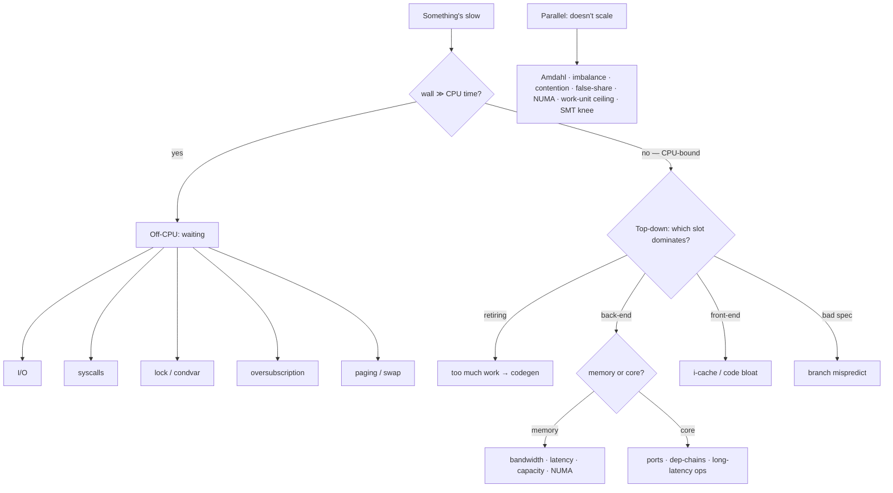

# Performance diagnosis — "something's slow", now what?

**Start here.** Entry point for the profiling doc set. Arch/tool-independent:
maps a *symptom → cause → confirm/rule-out → remedy*. It does **not** repeat
capture commands or reading-traps — it links to them:
- **Capture the signal:** [`m3-macos.md`](m3-macos.md) ·
  [`x86-linux.md`](x86-linux.md)
- **Don't misread it:** [`interpretation.md`](interpretation.md)

Written **2026-05-30**. Principle, not version-bound.

## Contents

- [The map](#the-map)
- [Step 0 — is it even on-CPU?](#step-0--is-it-even-on-cpu)
- [Off-CPU](#off-cpu--the-cpu-isnt-the-bottleneck-something-is-waiting)
- [On-CPU](#on-cpu--route-by-top-down-slot)
- [Parallel scaling](#parallel--it-doesnt-get-faster-with-more-threads)
- [Allocation and churn](#allocation-and-churn)

## The map

## Step 0 — is it even on-CPU?
Cheapest first cut. Compare wall-clock to CPU time (`time ./bin` → `real` vs
`user`+`sys`; or a profiler's on-CPU %). **wall ≫ CPU ⇒ off-CPU** (waiting);
**wall ≈ CPU ⇒ on-CPU** (computing). Don't open a counter profiler for an I/O
wait. If the wait is on a GPU fence or present, or the symptom is frame or
pass time, switch to [`gpu-diagnosis.md`](gpu-diagnosis.md). If the code
runs as WebAssembly in a browser, read [`wasm.md`](wasm.md) before
capturing: the engine tiers and the browser scheduler are part of the
measurement.

## Off-CPU — the CPU isn't the bottleneck, something is waiting
Capture: blocked/off-CPU profile (Linux `perf sched` / off-CPU sampling; macOS
System Trace / `spindump`).

| Cause | Signal | Confirm ↔ rule out | Remedy class |
|---|---|---|---|
| I/O-bound | high `real`, low `user+sys`; iowait | off-CPU time in read/write/fsync | async/batched I/O, mmap, bigger buffers, cache hot data |
| Syscall-heavy | `sys` ≫ `user` | `strace`/`dtruss` counts; off-CPU in syscalls | batch/eliminate calls, `io_uring`, bigger units |
| Lock / condvar | stalls or negative scaling; threads blocked | off-CPU/thread-states in lock wait | shrink critical section, finer/lock-free, per-thread |
| Oversubscription | wakeup/ctx-switch storm; >1 runnable per core | thread-states; ctx-switch count | threads ≈ cores; pin (`taskset`); fewer pools |
| Paging / swap | RSS near RAM; major faults | `vmstat`/VM Tracker; fault counters | shrink footprint, `mlock` hot, compress, stream |

## On-CPU — route by top-down slot
Capture the slot breakdown first: x86 `perf stat --topdown` / `toplev`
(x86 §Recipe 3); M-series `xctrace` "CPU Counters" (m3 §Recipe 3). **Top-down
slots ≠ IPC** — see interpretation.

### Retiring-bound — too many instructions (you're doing too much work)
| Cause | Signal | Confirm ↔ rule out | Remedy |
|---|---|---|---|
| Redundant / algorithmic | high retiring + high instr/op | instr count tracks the redundant work; sampler shows the loop | better complexity, hoist, memoize, cut work |
| Not vectorized | scalar hot loop | disasm shows scalar (m3/x86 §codegen); remarks show missed vectorize | help auto-vec (contiguous, no aliasing, known trip count) |
| **Instruction-count-bound** | a change cuts instr but **CPI rises** & misses tiny | the win/loss tracks instruction *count*, not cache (CPI↑, LLC≈0) | reduce instructions (fast path, strength-reduce); do **not** chase cache here |
| Expensive ops | slow op in loop | disassembly | contract-safe alternative |

For expensive arithmetic, consider batching, lookup tables, or an appropriate
approximation. Relax floating-point semantics only when the numeric contract
permits it.

### Back-end memory-bound
| Cause | Signal | Confirm ↔ rule out | Remedy |
|---|---|---|---|
| Bandwidth | large *streaming* working set | high LLC-miss + sequential; near DRAM BW ceiling | tile/block, fewer bytes/elem (SoA, narrow types), streaming stores |
| Latency | random / pointer-chasing | high load-latency, **low** BW use, low MLP | locality, SoA, SW prefetch, cut indirections |
| Capacity | miss rate jumps when working set crosses a cache size | sweep size → step at L1/L2/L3 | block to fit the level; shrink footprint |
| **NUMA-remote** | multi-domain; perf drops past a node/socket boundary | per-node local/remote DRAM counters | parallel **first-touch**, `numactl` policy → full workflow: [numa.md](numa.md) |

### Back-end core-bound
Ports / **dependency chains (low ILP)** / long-latency ops. Confirm: back-end
bound but memory stalls low (`toplev` core-bound). Remedy: break dep chains
(multiple accumulators), shorten critical path, cheaper ops.

### Front-end-bound
i-cache / iTLB misses, code bloat, bad layout. Confirm: top-down front-end;
high i-cache miss. Remedy: LTO, PGO/BOLT, hot/cold split, **fewer template
instantiations**, stop inlining cold code.

### Bad speculation — branch mispredict
Confirm: high branch-miss; top-down bad-spec. Remedy: branchless/predication,
sort or group inputs, hoist predictable branches out of the loop,
PGO / `__builtin_expect`, table dispatch.

### Codegen (cuts across retiring / front-end)
Missed inline, missed vectorize, compiler cliff, **SIMD net-negative**. Confirm:
remarks + disasm (m3 §Recipe 5/4, x86 §Recipe 4). Remedy: pin/upgrade the
compiler, LTO, restructure to help the optimizer; for **SIMD net-negative**,
*delete the explicit SIMD* when the scalar already auto-vectorizes (compare
instruction count, not IPC — see interpretation).

## Parallel — it doesn't get faster with more threads
First rule out Amdahl: a 10%-serial program caps at 10× no matter the core
count. Then:

| Cause | Signal | Confirm ↔ rule out | Remedy |
|---|---|---|---|
| Serial fraction (Amdahl) | speedup plateaus low ∀ T | ceiling ≈ 1/serial-fraction | parallelize / shrink the serial part |
| Load imbalance | some threads finish early | per-thread time spread | dynamic schedule, over-decompose ≥4×T |
| Lock contention | negative scaling; threads in lock wait | contention/off-CPU profiler | shrink/split critical section, lock-free, per-thread accumulate |
| False sharing | scaling loss | `perf c2c` | pad to measured line size |
| Allocator contention | malloc-heavy parallel stalls | time in the malloc lock | per-thread arena/pool, `reserve`, reuse |
| NUMA-remote | worsens past a domain boundary | per-node remote traffic; bad-placement control ([numa.md](numa.md)) | ownership/placement workflow: [numa.md](numa.md) |
| **Work-unit ceiling** | flat past some T < cores | `effective = min(T, work/grain)` or pool size | more independent units; over-decompose |
| **SMT / HT knee** | bend where logical > physical cores | `lscpu` physical vs logical; bend at physical count | don't expect linear past physical; pin to physical |
| Oversubscription | thrash when threads ≫ cores | ctx-switch storm | threads ≈ cores |

For false sharing, measure the target's cache-line size rather than assuming a
portable constant.

## Allocation and churn

This commonly appears as malloc time or allocation back-pressure.
malloc in a hot loop / container regrowth / refcount churn. Confirm: alloc
profiler (macOS Instruments Allocations; Linux `heaptrack`/`massif`); samples in
`malloc`/`free`/`operator new`. Remedy: `reserve()`, pool/arena, move not copy,
value types over `shared_ptr`, reuse buffers.

---
→ Capture: [m3](m3-macos.md) · [x86](x86-linux.md) ·
Read it right: [interpretation](interpretation.md)
