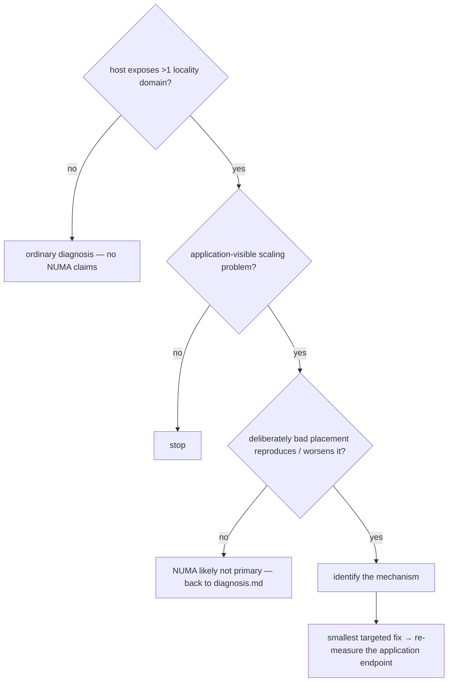

# NUMA and topology-sensitive performance — prove it, then place data

Load this only after [`diagnosis.md`](diagnosis.md) routes here: a NUMA-remote
signal in the memory-bound or parallel tables, or a scaling cliff at a
plausible topology boundary. Capture mechanics stay in
[`x86-linux.md`](x86-linux.md); reading traps in
[`interpretation.md`](interpretation.md) all apply.
Principle, not version-bound; verify tool/kernel support on the actual host.
Linux-first with Windows notes; macOS has no NUMA placement interface (see
[Portability](#portability-and-cc-notes)).

## Contents

- [Governing principle](#governing-principle)
- [Decision gate](#decision-gate)
- [Topology model](#topology-model)
- [Diagnostic workflow](#diagnostic-workflow)
- [Symptom → first hypotheses](#symptom--first-hypotheses)
- [Remedy ladder](#remedy-ladder)
- [Memory-policy starting points](#memory-policy-starting-points)
- [Confounders to hold fixed](#confounders-to-hold-fixed)
- [Metrics](#metrics)
- [Portability and C/C++ notes](#portability-and-cc-notes)
- [Platform tools](#platform-tools)
- [Benchmark discipline](#benchmark-discipline)

## Governing principle

NUMA optimization is **topology-aware data ownership first, execution
placement second, load balancing third**. The goal is not to maximize
percent-local accesses; it is to maximize useful application work within its
latency/throughput constraints. A change that improves locality percentage
but slows the application is a regression.

A "NUMA-looking" scaling problem may actually be: remote-DRAM latency ·
memory-controller/fabric bandwidth · cache-line bouncing (coherence) · false
sharing · serial first-touch · allocator placement · OS thread migration ·
poor partitioning · over-constrained affinity · kernel auto-balancing page
migration · an LLC/CCD/SNC/NPS boundary that is not a socket at all. Require
evidence for the specific mechanism before recommending NUMA-specific code.

## Decision gate



"Identify the mechanism" means naming one of: placement, bandwidth, latency,
coherence, scheduling — each has a different fix class below.

Never introduce topology abstractions, custom allocators, explicit page
migration, or complex balancing merely because the machine has NUMA.

## Topology model

`local/remote node id` is not a sufficient model. Reason in terms of:

```text
compute domains   CPUs/cores/workers and their cache (LLC) relationships
memory targets    DRAM nodes, capacity, tier (DRAM / HBM / CXL / far)
I/O targets       GPU / NIC / PCIe locality
directional costs measured latency and bandwidth per
                  compute-domain → memory-target pair
```

Modern machines may expose: several NUMA regions per socket (AMD NPS, Intel
SNC) · multiple LLC/CCD/CCX groups within one region · several distinct
remote distances · CPU-less memory nodes (CXL expanders) · virtual NUMA under
hypervisors. The scaling cliff you hunt may sit at any of these boundaries,
not just the socket.

## Diagnostic workflow

Follow in order; each step gates the next.

### 1. Confirm topology exists

```sh
lscpu -e=CPU,NODE,SOCKET,CORE,CACHE
numactl --hardware                    # nodes, per-node MiB, distance matrix
lstopo --of console                   # hwloc view: caches, dies, PCIe
cat /sys/devices/system/node/node*/distance
```

Record with results: CPU model · sockets · physical/logical cores · SMT ·
NUMA domains and cores/domain · LLC domains · NPS/SNC mode if applicable ·
memory per node · kernel · `kernel.numa_balancing` · THP state · governor ·
virtualization · compiler. One domain ⇒ stop here (cache-topology profiling
may still apply; NUMA findings do not).

### 2. Establish application-visible scaling behavior

Benchmark the unmodified application: useful throughput, latency
(p50/p95/p99/max where relevant), deadline success, parallel efficiency,
per-worker utilization. Do not sweep only powers of two — for every topology
boundary `C` from step 1 (LLC/CCD group, NUMA/SNC/NPS region, socket,
physical-core→SMT transition) run `C-2, C-1, C, C+1, C+2`. The key question:
**does the first worker outside the current locality domain make marginal
performance negative?** Where applicable measure both strong scaling (same
problem, more hardware) and weak scaling (proportionally larger problem);
ownership fixes often show modest strong-scaling but excellent weak-scaling
gains.

### 3. Characterize the machine

Firmware distance numbers are not measurements. For the pairs that matter,
measure dependent-load (pointer-chase) latency and streaming read / write /
copy bandwidth per compute-domain → memory-target pair — a small
vendor-neutral calibration benchmark pinned with
`numactl --cpunodebind=X --membind=Y`; Intel MLC or vendor equivalents can
supplement. These matrices are the reference frame for every later result.

### 4. Bad-placement control

Deliberately create the pathology: all data on node 0, workers spread across
all nodes (`numactl --membind=0` + full-machine affinity). This answers: is
the workload NUMA-sensitive at all, can your harness detect it, and how large
is the ceiling? **If deliberately bad placement barely moves the application
endpoint, deprioritize NUMA work** — the potential win is bounded by this
gap.

### 5. Separate execution placement from memory placement

Pinning a worker to node X does not put its data on node X. Test affinity
alone, then verify residency:

```sh
numastat -p $PID              # per-node pages for the process
cat /proc/$PID/numa_maps      # per-mapping policy + per-node page counts
```

These report **page placement and allocation-policy hits, not runtime access
traffic** — a page counted "local" may be read mostly by remote CPUs. Traffic
needs PMU evidence (step 7).

### 6. Check first-touch

Default Linux policy places a page on the node of the CPU that **first
touches** it. `std::vector<T> data(count)` value-initializes — the
constructing thread touches every page, so a later parallel traversal is not
the first touch and the whole array lands on one node. (Windows behaves
similarly: preferred node follows the first-accessing thread's ideal
processor unless overridden.) Experiment: reserve backing memory → assign
ownership → pin initialization workers → construct/write from the intended
domain → verify with `numastat`/`numa_maps`. Untouched-page tricks
(`reserve`+placement, `mmap` without prefault) keep first touch with the
worker.

### 7. Distinguish remote DRAM from coherence

Required distinction: a shared cache line bouncing between domains destroys
scaling even with perfect page placement, and its fix (shard/pad) is
different from placement fixes.

```sh
perf stat -e cycles,instructions,cache-misses,migrations,faults,cs -- ./BIN
perf mem record -- ./BIN && perf mem report   # load/store source + latency
perf c2c record -- ./BIN && perf c2c report   # shared-line contention
```

`perf c2c` on x86: rank by HITM, especially remote HITM; the report names the
lines, offsets, and source lines bouncing. On arm64 it runs over Arm SPE
(hardware + kernel support required); SPE has no HITM — the report defaults
to **peer** snoop statistics instead. High remote-DRAM traffic ⇒ placement /
bandwidth path; low remote DRAM but high HITM/peer ⇒ coherence: shard the
hot mutable state (statistics, completion counters, free lists, work/dirty
queues, scheduler state) per domain and pad to the measured line size
(`diagnosis.md` false-sharing row). **Lock-free does not imply
NUMA-friendly** — one contended atomic line bounces exactly like a lock.

## Symptom → first hypotheses

| Symptom | First hypotheses |
|---|---|
| drop at first cross-domain worker | placement, remote DRAM, fabric |
| one memory node's bandwidth saturated | serial first-touch / placement |
| worker's node busy, pages elsewhere | placement bug (step 5/6) |
| interleave beats local binding | bandwidth-bound shared data |
| random reads suffer, streaming fine | remote latency, low MLP |
| remote DRAM low, scaling still poor | coherence / locks / false sharing |
| high remote HITM (x86) / peer (Arm) | cache-line ping-pong |
| uneven utilization, good locality | scheduler imbalance, strict affinity |
| high CPU-migration count | insufficient affinity |
| page moves / NUMA hint faults | kernel auto-balancing at work |
| mean fine, p99 poor | migrations, hint faults, queue/lock convoy |
| `C` workers beat `C+1` | topology boundary / SMT knee / cliff |
| trouble starts past LLC capacity | cache working set, not NUMA |
| percent-local up, application slower | over-constrained scheduling |

## Remedy ladder

Apply in order; benchmark each stage separately against the application
endpoint. Never combine all stages and report only "NUMA-aware vs baseline"
— you cannot tell which stage paid.

```text
baseline
→ CPU affinity (workers stop migrating)
→ correct first-touch (data lands where it is used)
→ domain-local arenas, if profiling shows allocator placement misses
→ shard hot mutable infrastructure (counters, queues, free lists)
→ owner-computes routing (work moves to data)
→ topology-aware hierarchical stealing
→ selective replication of small read-mostly data
→ locality-vs-load balancing heuristics — last, and only with evidence
```

**Owner-computes.** Give data a stable home domain with preferred
workers/queues; move work toward data. Per domain: workers, queues, owned
data, scratch, counters, and a **remote inbox** — treat cross-domain work as
lightweight message passing rather than arbitrary remote shared-state
access.

**Hierarchical stealing.** Steal in discovered-topology order: own queue →
same LLC/cache cluster → same NUMA region → same socket → closest remote
→ farther. Derive the hierarchy from step 1, never hard-code it. A remote
execution beats an idle core: compare expected queue-wait cost against
remote-execution cost instead of enforcing strict affinity.

**Migration.** Higher threshold than one remote execution; use hysteresis —
tolerate short-lived remote hotspots, migrate (pages or ownership) only on a
persistent shift. Explicit `move_pages`/`migrate_pages` is a late-stage
tool, not an early optimization.

**Replication.** Only for small, read-mostly data: lookup tables, coarse
indexes, static metadata, topology structures. Measure replica update cost
and memory against remote reads avoided.

## Memory-policy starting points

Starting hypotheses to benchmark, not answers — the application endpoint
decides:

| Data pattern | Policy to investigate first |
|---|---|
| partitioned mutable state | local / home node |
| worker scratch, scheduler state | local |
| small read-mostly globals | replicate per domain |
| huge shared sequential stream | interleave may win |
| bandwidth-bound shared data | interleave / weighted interleave |
| stable ownership handoff | migration, cautiously |
| heterogeneous / far memory (CXL) | tier-aware / preferred / weighted |

Weighted interleave (`MPOL_WEIGHTED_INTERLEAVE`, Linux 6.9+) biases pages by
per-node weight in `/sys/kernel/mm/mempolicy/weighted_interleave/`; weights
affect new allocations only. Check the sysfs path exists before relying on
it.

## Confounders to hold fixed

- **Kernel auto NUMA balancing** (`kernel.numa_balancing`, a bit field:
  1 = migrate toward accessing CPU, 2 = memory-tiering promotion) samples by
  unmapping pages and taking hint faults — it can fix bad placement for you,
  fight your explicit placement, or inject p99 faults. For serious
  experiments run the 2×2: {application unaware, application-managed} ×
  {balancing on, off}, and record the setting with every result.
- **Huge pages.** Normal pages, THP, and explicit hugetlb are different
  experiment configurations: they change TLB reach, placement/migration
  granularity, first-touch granularity, and fragmentation. Never flip
  huge-page policy silently inside another comparison.
- Frequency/thermals, SMT, BIOS NPS/SNC mode: fixed and recorded, as in
  [`x86-linux.md` machine preparation](x86-linux.md#machine-preparation).

## Metrics

North star: application-visible — useful work/s, work within
deadline/budget, requests within SLA, p50/p95/p99/max, scaling efficiency.
Hardware metrics explain changes, they do not define success; **percent
local accesses is never the north star** (see final symptom-table row).

Diagnostic: page placement per node · local/remote DRAM traffic ·
fabric/interconnect bandwidth (UPI/xGMI) · per-domain DRAM bandwidth ·
HITM/peer transfers · per-domain utilization · queue delay · steals by
topology distance · CPU migrations · page faults/migrations · effective
frequency. Normalize to work: **cross-domain bytes per useful operation**
and **remote-HITM (or peer) events per useful operation** compare fairly
across configurations that complete different amounts of work.

## Portability and C/C++ notes

ISO C++ has no NUMA API; everything below is platform-specific. NUMA
placement is **page-granular** — never think per-object.

- **Linux:** `libnuma`/`numactl` first; `mbind`, `set_mempolicy`,
  `move_pages` only when lower-level control is justified by measurements.
  Default policy is first-touch (step 6). Affinity via
  `pthread_setaffinity_np`/`sched_setaffinity`.
- **Windows:** CPU Sets and topology APIs for placement; `VirtualAlloc2`
  with a `MemExtendedParameterNumaNode` extended parameter (or the older
  `VirtualAllocExNuma`) for preferred-node allocation; mind processor groups
  on >64-logical-processor machines.
- **macOS:** no comparable NUMA memory-placement interface; treat as a
  single domain and fall back gracefully.
- **Portable discovery:** hwloc is the strong option for topology discovery
  and binding. Keep it (and libnuma / Win32 types) out of public API
  surfaces — expose capabilities instead:

```cpp
if (topology.capabilities().memory_binding) { /* bind */ }  // else run flat
```

Where an arena is justified by profiling (remedy ladder, not before): one
large domain-local backing allocation → `std::pmr::memory_resource` over it
→ domain-owned objects/scratch/queues draw from their domain's resource.

## Platform tools

Semantic need first; verify support on the actual CPU/kernel/OS before
prescribing counters (PMU access rules in
[`x86-linux.md`](x86-linux.md#verify-counter-access-first)).

- **Linux/common:** hwloc/`lstopo`, `numactl`, `numastat`,
  `/proc/<pid>/numa_maps`, `perf stat/mem/c2c`.
- **Intel:** VTune Memory Access analysis, Intel MLC, UPI/uncore bandwidth;
  SNC changes the node map — re-run step 1 after BIOS changes.
- **AMD:** uProf, per-channel DRAM and xGMI traffic, IBS-backed memory
  sampling; NPS1/2/4 changes the node map.
- **Arm:** `perf mem`/`perf c2c` need SPE support in hardware and kernel;
  no HITM — use peer statistics. Do not assume x86 PMU event names.
- **Windows:** Windows Performance Analyzer / ETW; CPU Sets for affinity
  experiments.

## Benchmark discipline

All of [`interpretation.md`](interpretation.md) applies (median+spread,
fixed toolchain, perturbation, PMU availability). NUMA-specific additions:

- Profiling perturbs placement: instrumented runs take hint faults and may
  shift pages. Keep **timing runs** separate from **instrumented runs**.
- A/B runs must pin the whole configuration: topology/BIOS mode, affinity
  map, memory policy, `numa_balancing`, THP, SMT, governor. Alternate or
  randomize A/B order; warm up; keep per-run raw samples for tails.
- Save raw structured results per run with enough context to reinterpret:
  the step-1 record plus workers, affinity, memory policy, balancing/THP
  state, endpoint metrics, page distribution, cross-domain bytes/op,
  HITM-or-peer/op, effective frequency, commit.
- Present scaling charts with **topology boundaries drawn on the axis** —
  readers should not need to know worker 17 crossed a socket. Show the
  remedy ladder as separate increments, plus the measured latency/bandwidth
  matrices from step 3 as context.
